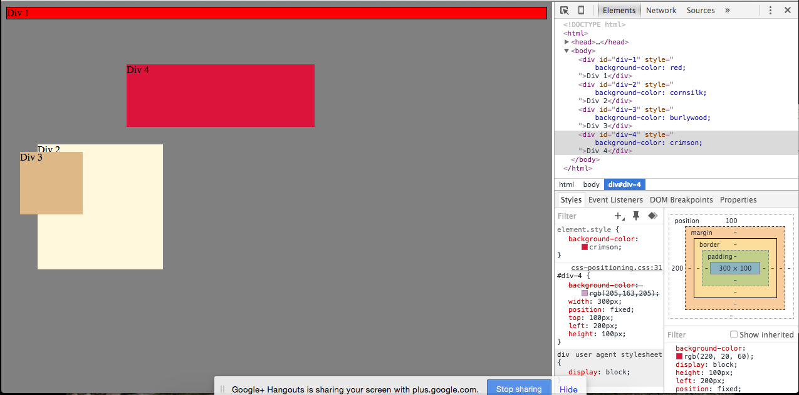
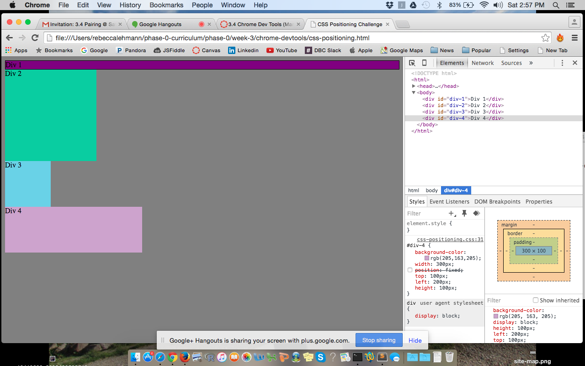
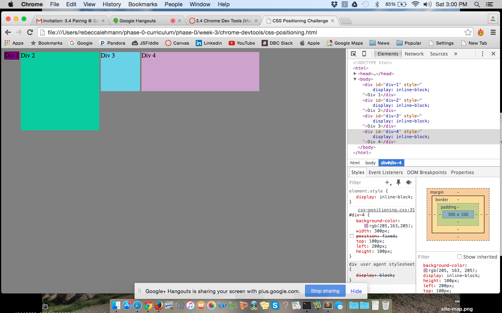
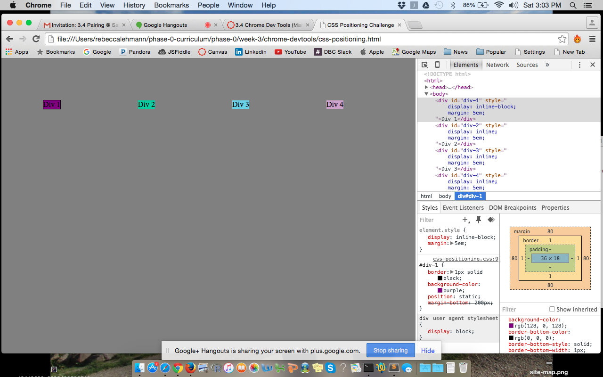
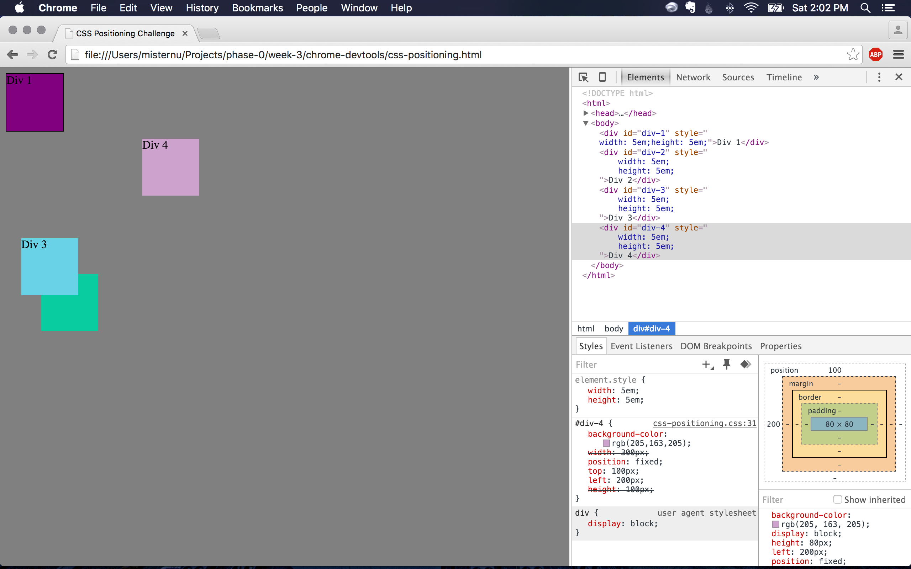
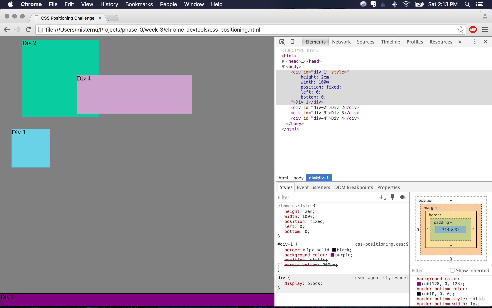
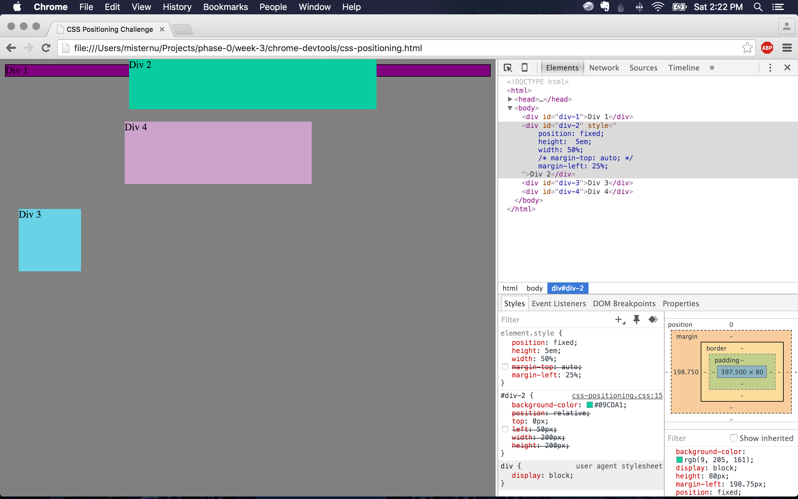
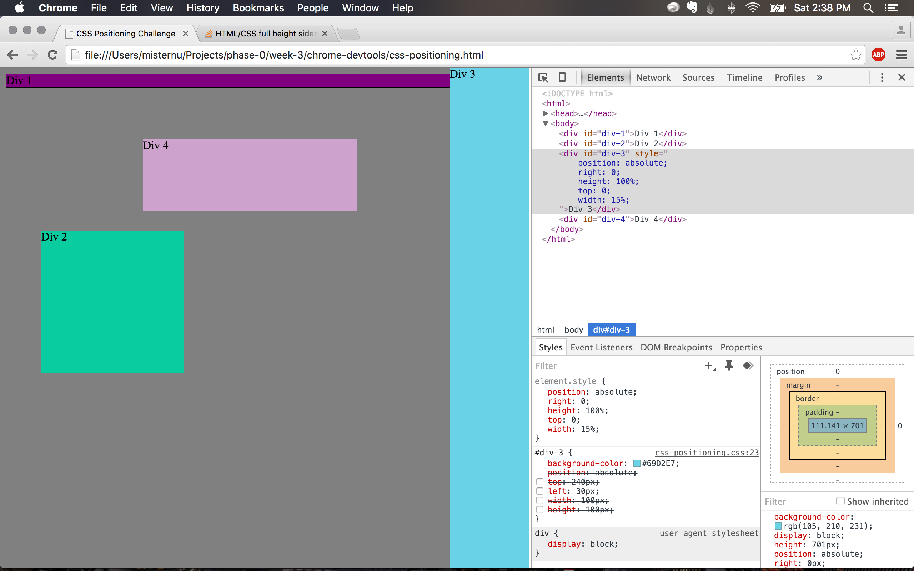
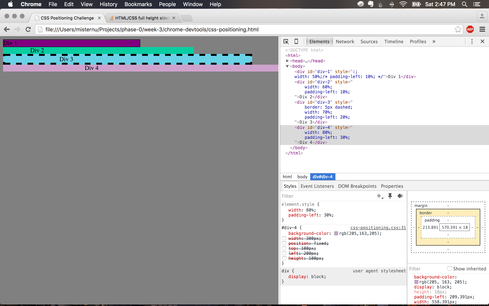

#Chrome DevTools Reflection

##Exercise 1:

##Exercise 2:

##Exercise 3:

##Exercise 4:

##Exercise 5:

##Exercise 6:

##Exercise 7:

##Exercise 8:

##Exercise 9:

- How can you use Chrome's DevTools inspector to help you format or position elements?

Chrome DevTools enables the user to directly manipulate the existing CSS code through the element.style function. The user can immediately see the output of his/her changes on the Chrome browser. I will use the inspector as a tool to see the output of my code, using it as "sandbxox" space for any potential changes. I especially enjoy that I can "erase" any changes merely by refreshing the page. This allows me to experiment without affecting the original code.

- How can you resize elements on the DOM using CSS?

You can resize elements by changing the height and width within CSS. You can also edit things like the margin, border and padding by viewing the metrics pane and editing the CSS from there.

- What are the differences between Absolute, Fixed, Static, and Relative positioning? Which did you find easiest to use? Which was most difficult?

Absolute positioning denotes that an element should be placed in relation to the first parent element that has absolute positioning, or to HTML if there are no parent elements with that positioning. Fixed positioning essentially glues an element to a certain part of the page. You might see this with headers and footers that move "with" the page as you scroll. Static positioning is the default positioning in CSS and essentially just places the element where it would normally go. Relative positioning places the element relative to where it would have landed by default with static positioning. I found static and fixed to be the easiest to use, static because it is the default and fixed because it's pretty intuitive. I found absolute positioning to be the most confusing and difficult because it places in relation to specific types of elements.

- What are the differences between Margin, Border, and Padding?

Padding is the space between the content and border of an element. The border serves as the outline of the element. The margin represents the space surrounding the element. By increasing or decreasing the margin, a user can move an element across the page, closer to or further from other elements (or the page limits).

- What was your impression of this challenge overall? (love, hate, and why?)

I found this challenge to be incredibly experimental (a lot of "let's try this and see what happens"). I don't necessarily think that was a bad thing, per se, but I do think it can quickly lead to using less-than-best practices. At times it felt a little bit tedious and frustrating, mainly when I couldn't place an element where I wanted it to go. However, I imagine with practice, the positioning process will become more intuitive and less "trial and error." I will say, it is exciting to begin to learn the necessary tools to creating my own web page.
