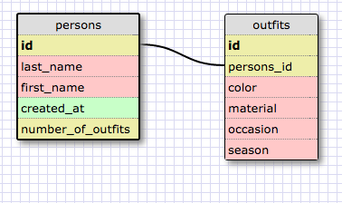

1) SELECT * FROM states;
2) SELECT * FROM regions;
3) SELECT state_name, population FROM states;
4) SELECT state_name, population FROM states ORDER BY population desc;
5) SELECT state_name FROM states WHERE region_id = 7;
6) SELECT state_name, population_density FROM states WHERE population_density > 50 ORDER BY population_density asc;
7) SELECT state_name FROM states WHERE population BETWEEN 1000000 AND 1500000;
8) SELECT state_name, region_id FROM states ORDER BY region_id asc;
9) SELECT region_name FROM regions WHERE region_name LIKE '%Central%';
10)
SELECT regions.region_name, states.state_name
FROM regions
INNER JOIN states
ON regions.id = states.region_id
ORDER BY regions.id;

- What are databases for?

Databases are designed to store data in a structured, easily accesible way. Relational databases organize the data into one or more tables.

- What is a one-to-many relationship?

A one-to-many relationship is one where an individual key corresponds to multiple values (ex. a teacher could have many students). These relationships cannot effectively be displayed using a single table.

- What is a primary key? What is a foreign key? How can you determine which is which?

A primary key uniquely identifies every record in a table. A foreign key is a field in one table that represents the primary key of another table. The primary key is often the leftmost column and (as stated) is uniquely tied to each individual record in the table. In the challenge, we dealt with regions and states tables. In states, the "id" represents the primary key of the table. The region_id is not a unique column in the states table, as multiple states have the same column. However, it does represent a foreign key within the states table because it is the primary key of the regions table.

- How can you select information out of a SQL database? What are some general guidelines for that?

You can use the SELECT clause to select information out of an SQL database. In order to select all data from a given table, you can use the * symbol. The SELECT clause is tied to the FROM clause, which indicates the table you want to select from. Below are several basic SQL clauses that are helpful to know:

    - WHERE: specifies a condition for selection
    - LIKE: used in conjunction with WHERE, uses wildcard symbols (_ or %) to specify records that contain a certain value
    - BETWEEN: also used in conjunction with WHERE, it specifies a range for the values, separated by AND
    - ORDER BY: order the selected records, either ascending (asc) or descending (desc)

