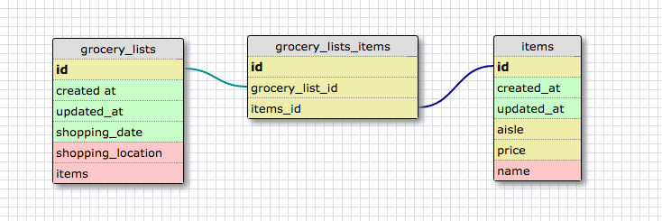

# Release 2: Create a One-to-one Schema

For the one-to-one schema, I used the example of people and drivers licenses. I created two tables, persons and licenses. The example represents a one-to-one relationship because each person can only have one license number and each license number is uniquely associated to exactly one person.

# Release 3: Many to Many Realtionships

#Release 6: Reflect

- What is a one-to-one database?

A one-to-one database contains tables where any given row in one table has at most one matching row in a related table.

- When would you use a one-to-one database? (Think generally, not in terms of the example you created).

One-to-one databases are useful when handling values that represent unique identifiers. With things like license numbers, SSNs, people, where the information is mutually precise and unique, one-to-one relationships make sense.

- What is a many-to-many database?

A many-to-many database contains tables where a given value in Table A relates to more than one value in Table B, and vice versa.

- When would you use a many-to-many database? (Think generally, not in terms of the example you created).

You would use a many-to-many database when the relationships between tables involve multiple records. If a field in Table A relates to many items in Table B and a field in Table B relates to many items in Table A, then a many-to-many database is useful. The two tables can effectively be joined with a join table, which essentially holds the keys of the related tables.

- What is confusing about database schemas? What makes sense?

Database schemas seem pretty straightforward, I imagine I will primarily be dealing with one-to-many and many-to-many relationships. The basic idea makes a lot of sense, so I'm not particularly confused. However, I imagine when multiple tables are involved, database schemas could become confusing.